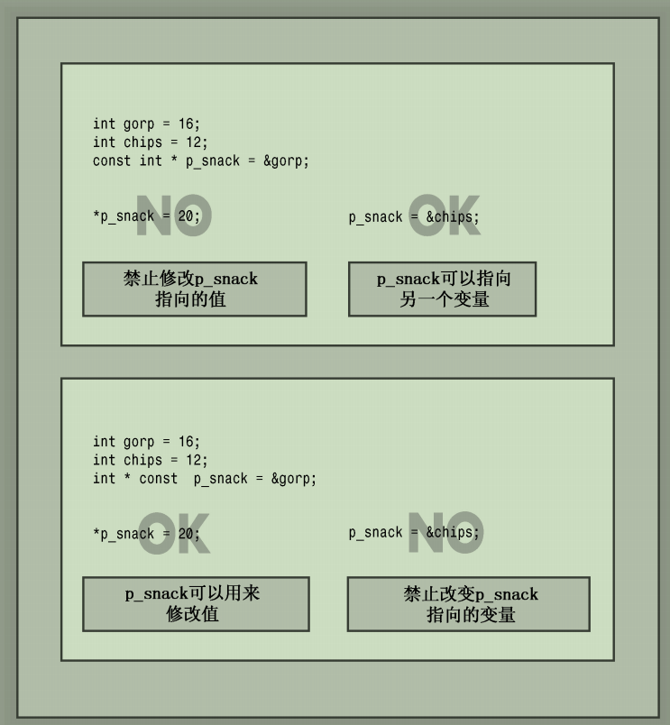

## 02.开始学习C++
### C++注释
注释分为两种
- `C`风格注释 `/*注释内容*/` 
- `C++`风格注释， 以 `//` 开头

### C++预处理器
`#include <iostream>` 就是一个预编译指令，会在源代码被编译之前，将 `iostream` 的头文件添加进来；只做添加和替换，不检查语法错误；
可以使用预处理参数 `-E` 来进行验证

```cpp
#include <iostream>
int main() {
    using namespace std;
    std::cout << "hello world" << std::endl;
    return 0;
}
```
通过如下命令来验证
```cpp
g++ -E hello.cpp -o hello.i    //只做添加和替换
```

## 03.处理数据
程序的本质就是处理数据；计算机按照  `0` `1` 的方式来存储数据；

计算机内存的基本单位是位 `bit`；一位只能用 `0` 或者 `1` 来表示；字节 `byte` 通常指的是 `8` 位的内存单元；`1KB` 等于 `1024`字节，`1MB` 等于 `1024KB`

如果 `int` 占用 `16` 位，那么 `int` 可以存储的范围就是 `2^{15}`，也就是 `-32768~32767` （第一位必须是符号位）

使用 `sizeof` 关键字可以查看数据类型所占用的字节大小，输出单位是**字节**

[Chapter03/sizeof.cpp](Chapter03/sizeof.cpp)


数据类型分为 **基本类型**和**复合类型**；变量存储在计算机中，必须要记住三个基本属性：
- 信息存在哪里
- 存储什么值
- 存储什么类型的信息

### 基本类型
基本类型主要是整型和浮点型，还有一些基于当前类型的变体
- 整型  `short` `int` `long`
- `C99`标准新增的 `long long` 以及 `unsigned long long`，类型至少为 `64`位
- 字符型 `char`，使用一个字节存储 `8 bit`
- 布尔类型 `bool` 一个字节存储 `8 bit`，任何非 `0` 的数都是 `true`，`false` 都会被转换成 `0`
- 浮点型  `float` `double` `long double`

### 复合类型
- 由基本数据类型组成

### 无符号类型
- 整型的 `short` `int` `long` 都有无符号的变体，可以增大变量能够存储的最大值
- 假设 `short` 表示的范围是 `-32768~32767 (2^{15})`，那么无符号位则可以表示的范围是 `0~65535 (2^{16})`，将近扩大到了一倍
- 哪些数据可以使用无符号类型？
    - 客观事实存在的，比如年龄，人口数量这些等，从客观上来说不可能存在负数
    - 定义无符号类型只需要在类型前面加上 `unsigned` 即可；注意 `unsigned` 本身是 `unsigned int` 的缩写


### 变量初始化
变量在声明后，其内存储的是一些奇奇怪怪的值；为了避免不必要的麻烦，建议在声明变量的时候就对其进行初始化；

以下几种初始化的方式均可
```cpp
int owls = 101; //C初始化
int wrens(432);  // C 初始化

int hamburgers = {24}; //C11初始化方式，也可以省略 = 
int emus{5}; // C11

int rocs = {}; //变量将被初始化成0
int psychics{};  //变量将被初始化成0
```

使用 `{}` 进行初始化的方式被称之为**列表初始化**


### 进制类型
`C++` 使用前一（两）位来表示进制类型
- 第一位是 1~9，则基数为十（十进制）
- 第一位是 0，第二位是 1~7，则基数为八（八进制），例如 `042` 等同于十进制的 `34` (4*8+2=34)
- 如果前两位是 `0x` 或者 `0X`，则表示为十六进制；例如 `0xF`等同于十进制的 `15`

[进制输出展示](Chapter03/hexoct.cpp)

### const限定词
在 `C` 中通常使用预编译指令 `#define` 来定义常量，但在 `C++` 中有了更好的做法，使用 `const` 来进行限定，两者作用是相同的；如果你的程序要兼容 `C`，那么使用 `#define` 是最好的选择，否则使用 `const`

### 运算符
`C++` 中有 5 种基本的运算符
- `+` 表示对操作数进行加法运算
- `-` 表示对操作数进行减法运算
- `*` 表示对操作数进行乘法运算
- `/` 表示对操作数进行除法运算
    - 操作数都是整数，结果为商的部分；例如 `9/2=4`，小数部分被直接丢弃
- `%` 对操作数进行取模（两个操作数必须都是整型，该操作符用于浮点型将导致编译错误）


## 04.复合类型
复合类型使用多个基本数据类型组成，包括但不限于数组，`C-风格`字符串、`string` 类字符串、结构、共用体、枚举以及指针等

### 数组
数组是一类可以存储多个相同类型的数据格式，在内存中的存储位置是连续的；

声明数组需要满足以下三个规则
- 存储在每个元素中的值的类型
- 数组名
- 数组中的元素个数

```cpp
typeName arrayName[arraySize]; //定义数组的格式

short months[12]; //定义了一个类型为 short、长度为 12 的数组
```
数组的访问通过下标来进行访问，编号从 `0` 开始；数组的长度也可以通过 `sizeof(数组名)/sizeof(元素类型)`来进行计算；如果数组在使用之前，不进行赋值，那么它的值将是不确定的；

[数组的定义和赋值以及获取数组长度](Chapter04/arrayone.cpp)

### 数组初始化规则
```cpp
float hotelTips[5] = {5.0, 2.5}; //只对前两个位置上的元素赋值，其他位置上的元素都被设置成 0
long totals[500] = {0}; //所有位置上的元素都被赋值成0
long totals[500] = {1}; //只对第一个位置上的元素赋值为1，其他位置上的元素都初始化为0

short things[] = {1,2,3,4}; //编译器会自动计算数组的长度为4，但一般不推荐这么做
```
在 `C++11` 中，如果采用初始化列表的方式初始化数组，可以省略 `=`; 例如
```cpp
double earnings[4] {1.2e4, 1.6e4, 1.1e4, 1.7e4};
unsigned int counts[10] = {}; //不包含任何东西，则所有的元素都被初始化成 0 
float balances[100] {}; //同上，全部为 0
```


### 字符串
字符串是存储在内存的连续字节中的一系列字符；在 `C++` 中可以使用两种，一种来自于 `C` 语言，通常称为 `C-风格字符串`，还有一种是 `string` 类库中的方法；

#### 1.C风格字符串

C 风格字符串具有特殊的性质，以空字符（`null character`）结尾，空字符被写作 `\0`，其 `ASCII` 码值为 `0`，用来标记字符串结尾；例如
```cpp
char dog[8] = {'b', 'e', 'a', 'u', 'x', ' ', 'I', 'I'}; //不是字符串，是一个字符数组
char cat[8] = {'f', 'a', 't', 'e', 's', 's', 'a', '\0'}; //字符串
```
还有一种字符串常量的方式初始化，但结尾仍然有隐式的空字符
```cpp
char bird[11] = "Mr. Cheeps"; // \0 会被自动添加到结尾，注意长度需要包含 \0 字符
char fish[] = "Bubbles"; //编译器会自动推导长度
```

注意：`sizeof(数组名)` 计算的是整个数组的长度，而 `strlen(数组名)` 计算的是存储在字符串中的长度，且不包含空字符；

[字符串练习](Chapter04/4.2_string.cpp)

`cin` 在确定完成输入的时候，会通过 **空格**、**制表符**、**换行符**来确定字符的结尾位置；这意味着 `cin` 在湖区字符数组输入时，只读取一个单词，获取到该单词后，`cin` 将字符串放到数组中，并在结尾添加空字符；
例如
```cpp
#include <iostream>
int main() {
    using namespace std;
    const int size = 20;
    char name[size];
    char name2[size];

    cout << "Enter your name: ";
    cin >> name;
    cout << "Enter your another name: ";
    cin >> name2;

    cout << name1 << "===" << name2 << endl;

    return 0;
}
```
当你输入 `John Mack` 时，最后一行输出语句就会自动执行，不会等到你第二次输入 `name`; 原因就是因为它把 `John` 放入了 `name1`，把 `Mack` 放入了 `name2`;

如果你要读取一行输入，那么就需要使用 `getline()` 或者 `get()`；两者的区别就是 `getline()` 会丢弃换行符，而 `get()` 不会，会将换行符保留在输入队列中;

```cpp
cin.getline(name,20); //这一行输入的字符不能超过 19 个

```


#### 2.string类
`C++98` 中添加了 `string` 类扩展了 `C++` 的类库，使得字符串的使用更加简单；`string` 对象和字符串数组之间的主要区别就是可以将 `string` 对象声明为简单变量，而不是数组；

```cpp
// 需要引入 string 头文件 
// #include <string>
string str1;
string str2 = "panther";

cin >> str1; //输入到 str1 中时，string 对象会自动调整大小
```

初始化方式（不管是 `string` 还是 `C-风格字符串`，都可以使用列表初始化的方式去进行初始化）
```cpp
char first_date[] = {"Le Chapon Dodu"};
char second_date[] {"The Elegant Plate"};
string third_date = {"The Bread Bowl"};
string fourth_date {"Hank's Fine Eats"};
```

### string类的操作
在没有增加 `string` 类之前，对字符串的操作需要使用 `C string` 库来完成操作；例如 `strcpy()` 将字符串赋值到字符数组中、`strcat()` 将字符串附加到字符数组末尾
```cpp
strcpy(charr1, charr2); //把 charr2 拷贝到 charr1中
strcat(charr1, charr2); //把 charr2 追加到 charr1 中
```

`string` 则可直接使用赋值和 `+` 操作符来处理，简化了不少；

[c风格字符串和string类操作字符串的操作比较](Chapter04/4.9_strtype3.cpp)

在输入上也有些不同
```cpp
cin.getline(charr1, 20); //需要指明长度，可能会有越界的风险
getline(cin, str1); //会自动计算长度
```


### 结构（struct）
和 `C` 语言一样，`C++` 也支持结构
```cpp
//定义结构
struct inflatable {
    char name[20];
    float volume;
    double price;
};

//使用结构，可以省略 struct 关键字，这点与 C 不同
inflatable hat;
inflatable woopie_cushion;

struct inflatable goose; //C 必须要有 struct 关键字
inflatable vincent; //C++ 中 struct 不是必须的
```
#### 结构体的赋值和访问
- 赋值通过 `{}` 来进行赋值
- 访问通过 `.` 操作符来进行访问

结构体的初始化方式和数组一样，也可以采用初始化列表的方式进行初始化
```cpp
inflatable guest = {"Hello", 1.88, 29.99};
inflatable guest2 {"World", 2.77, 30.1}; // = 也可以省略
inflatable guest3 {}; //没有任何东西，那么结构里面的各个成员都会被设置成0

cout << guest.name << endl; //访问结构体属性
cout << guest.name[0] << endl; //访问结构体的第一个字符
cout << guest.price << endl; //访问 price
```

结构和结构之间的赋值也是允许的，例如 `guest = guest2`;

#### 结构体数组赋值
```cpp
inflatable guest[2] = {
    {"zhangsan", 12.0, 12.34}, //索引为0的赋值
    {"lisi", 13.5, 22.34} //索引为1的赋值
}

cout << "索引为0 name 属性的值 " << inflatable[0].name << endl;
cout << "索引为1 name 属性的值 " << inflatable[1].name << endl;
```

[结构体赋值和取值操作练习](Chapter04/4.13_arrstruc.cpp)


### 共用体（union）
共用体是一种数据格式，能够存储不同的数据类型，但只能同时存储一种；语法和结构体相似

```cpp
union one4all {
    int int_val;
    long long_val;
    double double_val;
};
```
在不同的时刻只有一个属性有值；

```cpp
one4all pail;
pail.int_val = 15; //int 属性有值
cout << pail.int_val << endl; 

pail.double_val = 1.38; //double 属性有值，int 值将会被丢失
cout << pail.double_val << endl;
```


### 枚举（enum）
提供了一种可以替代 `const` 创建符号常量的方式，但必须按照严格的限制进行；语法和结构类似

```cpp
enum spectrum {red, orange, yellow, green, blue, violet, indigo, ultraviolet};  //对应的值分别为 0-7
```
默认情况下，`red` 的值为 `0`, 以此类推，`ultraviolet` 的值为 `7`。这些常量称为枚举量；可以通过赋值运算符来显示设置枚举量的值

```cpp
enum bits {one=1, two=2, four=4, eight=8}; //指定的值必须为整数
enum bigstep {first, second =100, third}; //first 默认为0， third 默认为 second+1= 101
enum {zero, null = 0, one, num_one = 1}; //可以指定多个值相同的枚举量
```


### 指针
在之前提到过，计算机在存储数据的时候，必须要跟踪的三种基本属性：
- 信息存储在哪里？
- 存储的值是多少？
- 存储的信息类型是什么类型？

为了满足以上的条件，`C++` 要求我们在定义变量的时候，必须要指明变量的类型以及变量存储的值；
```cpp
int a=5; //显示定义变量
```
为了给开发人员最大限度的提升灵活性，`C/C++`为我们提供了另一种复合类型-指针；

通俗来讲，指针也是一个变量，只不过是一个存储了变量地址的变量；可以通过 `&` 来获取一个变量的地址，通过 `*` 符号来对指针进行解引用获取变量的值；

```cpp
int a = 5; //定义一个变量
int *p = &a; //定义一个指针，存储变量的地址
```

**注意：`int*` 是一个复合类型，表示的是指向 `int` 的指针**

我们通过 `cout` 输出一个指针时，将会为我们打印出变量的地址

```cpp
#include <iostream>
using namespace std;

int main() {
    int a = 4;
    int *p = &a;
    cout << "a = " << a << endl;
    cout << "p=" << p << endl;  // 输出变量 a 的地址
    cout << "*p = " << *p << endl; //输出变量 a 的值

    return 0;
}
```
#### 为什么要使用指针
在运行时期去分配内存，减少内存的占用；

一般情况下，我们在使用显式声明变量的时候，在编译时期就会为变量分配内存；如果程序原本用不到这么多内存，那么就会造成内存浪费；

例如 `int arr[20]` 表示分配了 `20` 个 `int` 类型的变量所占用的内存，该分配操作在编译时期就会分配；如果我们根本用不到 `20` 个 `int` 类型的变量，那么那些没有赋值的元素将一直占用内存，造成内存浪费；而我们使用指针，可以在运行时期去确定我们本次需要多少个 `int` 类型的元素内存，然后再去向操作系统申请内存；

#### 使用 new/delete 关键字
一般在 `C/C++`中，我们使用 `new` 关键字在运行阶段申请内存大小，且使用指针来跟踪新分配的内存位置；（使用 `new` 分配的内存，返回的是指针类型，由于没有变量名称，所以我们只能通过指针来对变量进行访问）

```cpp
#include <iostream>

int main() {
    int *ps = new int; //分配一个 int 类型数据的内存
    delete ps; //释放 ps 内存

    int *ps = new int[10]; //申请一个包含 10 个元素的数组，返回的是数组元素的首地址（也是第一个元素的地址）
    delete[] ps; //释放 int 数组
    return 0;
}
```

- 不要用 `delete` 来释放不是 `new` 分配的内存
- 不要使用 `delete` 释放同一个内存块两次
- 如果使用 `new typeName[]` 为数组分配内存，则释放应该使用 `delete []` 来进行释放
- 如果使用 `new []` 为一个实体分配内存，则应该使用 `delete` 来释放
- 对空指针使用 `delete` 是安全的
- `delete` 是删除指针指向的内存，但不会删除指针本身，可以将指针再重新指向其他的内存块

#### 使用动态数组
一般情况下，`C++`将数组名解释成数组元素的第一个元素的地址；所以以下的方式是等价的
```cpp
double wages[3] = {10000.0, 20000.0,30000.0};
double *pw = wages;

//wages = &wages[0] = pw; 输出的都是数组元素的首地址；
```

因此在很多种情况下，可以用相同的方式使用指针名和数组名。但指针和数组名仍然有一些区别
- 如果是指针，可以修改指针的值，但数组名是常量，无法修改
- 对数组名应用 `sizeof` 得到的是数组的长度，而对指针应用 `sizeof` 得到的是指针的长度，即使指针指向的是一个数组；在 `sizeof` 的情况下，`C++` 不会将数组名称解释成地址；

对数组去地址时，数组名也不会被解释成地址；数组名通常被解释成第一个元素的地址，只有当对数组名 `&` 操作时，才会得到数组的地址；虽然他们两个是相同的；
```cpp
short tell[10]; 
cout << tell << endl; //等同于 &tell[0]，首元素的地址
cout << &tell << endl; //整个数组的地址
```

如果将 `tell + 1`, 则指针会偏移 `2` 个字节的位置；如果是 `&tell + 1` 那么指针会偏移 `20` 个字节的位置；换句话说，`tell` 表示的是一个 `short` 类型的指针（`* short`），而 `&tell` 是一个包含 `20` 个元素的 `short` 数组（`short(*)[20]`）

可以通过如下的方式来定义它
```cpp
short (*pas)[20] = &tell; //一个指向20个short元素的指针，因此 pas 的类型是 short(*)[20], 由于 pas被设置成 &tell，那么（*pas）便等价于 tell， （*pas）[0] 便为 tell 数组种的第一个元素
short * pas[20]; //这样便会变成一个存放 20个指针的数组
 ```

[动态数组的使用](Chapter04/4.18_arraynew.cpp)

### 指针和字符串
一般来说，如果给 `cout` 提供一个指针，它将打印地址；但是如果指针的类型是 `char *`，则 `cout` 将显示指向的字符串；
如果需要打印地址，那么需要将这种指针强制转换成另一种指针类型，例如 `int *`

```cpp
char name[20]="hello world";
cout << name << endl; // hello world
cout << (int *) name << endl; //0X..... 地址
```


### 使用 new 创建动态结构（struct）
```cpp
inflatable * ps = nwe inflatable;
```
需要访问结构体里面的变量，有两种方式
- 如果使用指针，则使用 `->` 操作符来访问
- 如果对指针解引用，则使用 `.` 操作符来进行访问

[指针对结构体变量赋值取值](Chapter04/4.21_newstruct.cpp)


### 自动存储、静态存储和动态存储
- 在函数内部定义的常规变量使用自动存储空间，函数调用时产生，函数调用结束时消亡，通常存储在栈中；满足后进先出原则（`LIFO`）
- 静态存储，在整个程序的执行期间都存在；定义方式有两种
    - 在函数外面定义它
    - 在声明变量时使用 `static` 关键字 `static double fee = 56.50;`
- 动态存储，由 `new` 和 `delete` 操作；通常被称为**自由存储空间（`free store`）**或者**堆（`heap`）**


## 05.循环和关系表达式
### for/while/do while 循环
以上三种循环都用来处理重复的任务，例如将 `hello world` 打印 `10` 次；

```cpp
for(int i = 0; i < 10; i++) { //for loop
    cout << "hello world" << endl;
}

int num = 10;
while(num > 0) { // while loop
    cout << "hello world " <<endl;
    num--;
}

num = 10; 
while { // do while loop
    cout << "hello world" << endl;
} do(num > 0)
```

### 基于范围的for循环(C++11)
`C++11` 新增了一种基于范围的循环，简化了循环任务；对数组（或者容器类，如 `vector`和 `array`）的遍历较为方便

```cpp
double prices[5] {4.99, 10.99, 6.87, 7.99, 8.49};
for(double x: prices) {
    cout << "x=" << x << endl;
}


for(int x: {1,2,3,4,5,6}) {
    cout << "x= " << x << endl;
}
```


### 嵌套循环和二维数组
二维数组定义
```cpp
typeName arrName[行数][列数];
```
定义一个四行五列的二维数组，并进行遍历
```cpp

// maxtemps[0] 表示第一行的一维数组
// maxtemps[1] 表示第二行的一维数组
// 以此类推
int maxtemps[4][5] {
    {1,2,3,4,5},
    {6,7,8,9,10},
    {11,12,13,14,15},
    {16,17,18,19,20}
};


//遍历二维数组
for(int i = 0; i < 4; i++) {
    for(int j = 0; j < 5; j++) {
        cout << maxtemps[i][j] << " ";
    }
    cout << endl;
}
```

### continue 跳过本次循环，继续执行下一轮
```cpp
for(int i= 0; i < 100; i ++) {
    if(i%2==0) {
        continue; //如果是偶数，则跳过
    }
    cout << i << endl; 
}
```

### break 跳出循环
```cpp
for(int i = 0; i < 10; i++) {
    if(i == 5) {
        break;
    }
    cout << i << endl; //打印 0 1 2 3 4
}
```

### 关系表达式
关系表达式常用来对两个值进行比较；常用的符号 `<`、`<=`、`==`、`>`、`>=`、或者 `!=`；
关系表达式的结果为 `bool` 类型，值为 `true` 或者 `false`


## 06.分支语句和逻辑运算符
分支语句通常为 `if`, `if else` 还有 `switch`；逻辑运算符通常为 `&&（逻辑与）`, `||（逻辑或）`, `!（逻辑非）`，条件运算符通常是三元表达式`?:`;

### if 和 if else 语句
```cpp
if(a > b) {
    cout << " a > b" << endl;
} else {
    cout << "a <= b" << endl;
}
```

### 逻辑表达式（与、或、非）
```cpp
//逻辑或判断顺序是从左到右，如果第一个判断成立，那么第二个判断将不会被执行；
5==5 || 5==9  //两个条件有一个成立，则为true
5>3 || 5> 10; //两个条件有一个成立，则为true

//逻辑与判断顺序是从左到右，如果第一个判断成立，那么第二个判断将不会被执行
//逻辑与要求两个表达式同时成立，有一个为 false，则为 false
5>3 && 5 < 9; //成立 true

//逻辑非对表达式取反
if(!(a > b)) //判断条件实际上是 a<=b

```
在 `C++` 中也可以使用 `and`, `or`, `not` 来表示
```cpp
int a = 10, b = 20, c = 30;
if (a < b and b < c) //也是有效语法
{
    std::cout << "a > b and b < c";
}
```

### `?.` 三目运算符
通常被用来代替 `if else` 的写法
```cpp
int a = 10;
int b = 20;
int c = 30;
int temp = a > b ? b : c; //如果 a>b, 则取b的值，反之则取c的值
```

### `switch` 语句
通常用来扩展 `if else if else` 的功能
```cpp
switch(integer-exp){
    case label1:
        statement(s);
        break;
    case label2:
        statement2(s);
        break;
    default:
        break;

}
```
还可以使用枚举量来作为 `switch` 的标签

[使用枚举量作为`switch`的标签](Chapter06/6.11_enum_switch.cpp)


### 简单文件输入输出
对于文件输入，`C++`使用了一个类似于 `cout`的东西；我们要使用 `cout` 在控制台输出内容，需要做如下准备
- 包含头文件`iostream`
- 头文件中定义了一个用于处理输出的 `ostream` 类
- 头文件中声明了一个名为 `cout` 的 `ostream` 变量（对象）
- 必须指明名称空间 `std`, 引用元素使用预编译指令`using`或者前缀`std::`;
- 结合 `cout` 和 `<<` 来显示各种类型的数据；

文件操作和其极其相似
- 包含头文件 `fstream`
- 头文件中定义了一个用于处理处处的 `ofstream` 类
- 需要声明一个或者多个 `ofstream` 变量
- 必须指明名称空间 `std`, 引用元素使用预编译指令`using`或者前缀`std::`;
- 将 `ofstream` 对象和文件关联起来，使用 `open()` 方法
- 使用完成后，需要调用 `close()` 方法将其关闭
- 结合 `ofstream` 对象和运算符 `<<` 来输出各种类型的数据

[内容写到文件中](Chapter06/6.15_outfile.cpp)

[从文件中读取数据](Chapter06/6.16_sumafile.cpp)


## 07.函数
要使用函数，必须完成以下工作
- 提供函数定义
- 提供函数原型
- 调用函数

[简单函数定义和调用](Chapter07/7.1_calling.cpp)


### 定义函数
函数分为两类：
- 没有返回值的函数（`void`函数）
- 有返回值的函数，必须有返回语句（`return xxx`）

```cpp
void functionName(parameterlist) {
    statements(s);
    return; //void 返回值，可以不需要 return
}

typeName functionName(parameterList) {
    statements(s);
    return value; //value 必须是 typeName 的类型
}
```

例如定义一个打印函数
```cpp
void cheers(int n) {
    for(int i = 0; i < n; i++) {
        std::cout << "Cheers! ";
    }
    std::cout << std::endl;
}
```

在函数原型中，允许不提供变量名，例如
```cpp
//以下两种原型都是可以的，原型中的变量名称相当于占位符，不必与函数定义中的变量名相同
int add(int a, int b);
int add(int, int); 
```


### 函数参数和按值传递
`C++`中通常传递都是按值传递，也就是传递给方法的实际上是参数的拷贝，在函数体内对参数做修改，在函数调用结束后，修改是不生效的；例如
```cpp
void swap(int, int); //

int main() {
    int a = 3; b = 5;
    cout << "Before: a = " << a << ", b = " << b << endl;
    swap(a, b);
    cout << "After: a = " << a << ", b = " << b << endl;
    return 0;
}

void swap(int a, int b) {
    int temp = a;
    a = b;
    b = temp;
}
```
调用 `swap` 方法后，`a` 和 `b` 的值并未发生变化，实际上只是把 `a` 和 `b` 的值的拷贝传递给了 `swap(int x, int y)` 中的实参，这种就是明显的按值传递；如果要正确实现两个数的交换，可以考虑用指针或者引用来实现；


按值传递的弊端：
- 如果是较小的类型，多一次数据拷贝，对程序的性能没有影响
- 如果是较大或者较复杂的结构体对象，那么一次拷贝将带来较大的内存开销


### 函数和数组
编写一个函数原型，入参为数组；例如
```cpp
int sum_arr(int arr[], int n); //入参为数组
int sum_arr(int* arr, int n); //入参为 int*
```
以上两个声明是等效的，在 `C++` 中，只有在函数原型中，`int *arr` 和 `int arr[]` 的含义才是相同的；他们都表示 `arr` 是一个 `int` 类型的指针；

[验证`int *arr` 和 `int arr[]`在函数原型中是否等效](Chapter07/7.5_arrfun1.cpp)

**注意**
> 将数组类型和元素数量告诉数组处理函数时，请通过两个不同的参数来传递它们；
>
> void fillArray(int arr[], int size); // 好的方式
>
> 而不要试图使用 [] 来传递数组长度
>
> void fillArray(int arr[size]); //不要使用这种方式


当我们在参数中传递数组时，传递的是指针；那么便可以通过数组名（指针）去修改数组里面的值，如果我们不希望原数组可以被修改，可以尝试在方法原型上加上 `const`, 禁止外部修改数组；
```cpp
// C++ 会将 const int arr[] 解释成 const int * arr;
void print_array(const int arr[], int n); //指针 arr 指向的是常量数据，不允许通过 arr 去修改值

arr[0]+= 10; //编译器将会报错

```

### 指针和 const（指针常量和常量指针）
使用两种不同的方式将 `const` 关键字作用在指针上；
- 让指针指向一个常量对象，可以防止指针修改指向的值
- 将指针本身声明成一个常量，可以防止指针改变指向

```cpp
// p 指向的是一个 const int 类型，不能修改数据
int age = 39;
const int * p = &age; //不能用 p 来修改 age 的值，但是可以通过 age 来修改它
*p+1; // 错误
age+=1; //正确
```

尽可能的使用 `const`
- 可以避免由于无意间修改数据而导致的编程错误；
- 使用 `const` 使得函数能够处理 `const` 和 非 `const` 实参，否则将只能接受非 `const` 数据。


```cpp
//p 本身就是一个 const，不能修改指向
int age = 39;
int year = 2025;
int * const p = &age; // 常量指针

p = &year; //错误，不允许修改指向
```



```cpp
double trouble = 2.0;
const double * const p = &trouble; //既不能修改指向，也不能通过p修改 trouble 的值，但可以通过 trouble 变量来修改值
```

### 函数和结构
和使用基本数据类型一样容易；也可以传递结构本身或者地址；例如
```cpp
struct rect {
    int x;
    int y;
};

void showRect(rect r); //传递结构本身
void calcRect(rect* r); //传递结构地址
void showRectExt(const rect * r); //传递地址，且加上 const 修饰

```

### 函数和递归
自己调用自己，称之为递归；但是需要注意递归调用的跳出条件；
```cpp
void recurs(argumentlist) {
    statements1;
    if(test) {
        recurs(argumentlist); //自己调用自己
    }
    statements2;
}
```


### 函数指针
和变量一样，函数也有地址；我们可以将一个函数 `func1` 的地址传给另一个函数 `func2`，那么就可以在 `func2` 的函数体中，通过传递过来的 `func1` 的地址，找到这个函数，并执行；

为了将函数的地址传递，需要做以下工作；
- 获取函数的地址
- 声明一个函数指针
- 使用函数指针来调用函数

获取函数的地址较简单，假设 `func()` 是一个函数，那么 `func` 就是函数的地址；

声明一个数据类型的指针时，必须指定指针指向的类型；同样声明指向函数的指针时，也必须指定指针指向的函数类型；假设
```cpp
double pam(int); // 声明了一个函数
double (*pf)(int); // 这种方式就是函数指针
```
> 区别
> double *pf(int); //表示 pf() 方法返回一个 指向 double 类型的指针
>
> double (*pf)(int); //表示是一个函数指针，切记不要忘记括号

函数指针也可以相互赋值，但需要注意函数指针的参数和返回类型必须相同；如果不相同，编译器将警告错误；

使用指针来调用函数
```cpp
double (*pf)(int); // 函数指针
(*pf)(5); //调用函数，等价于 pf(5); 
```
[函数指针练习](Chapter07/7.18_fun_str.cpp)


### typedef 创建别名
```cpp
typedef double real; //创建一个别名，类型为 double，这样我们声明变量的时候，可以用 double 也可以用 real 
```

## 08.函数探幽

### 内联函数 inline
内联函数，就是将函数原封不动拷贝到调用的地方，编译后就像没有方法调用一样；

优点和弊端:
- 加快了程序运行的速度，因为普通函数调用时需要记录调用地址，内联函数不需要
- 一次调用，拷贝一次；如果该方法被多个地方调用，会额外增加内存；

有选择的使用内联函数；


内联函数定义的要求：
- 在函数声明前加上关键字 `inline`;
- 在函数定义前加上关键字 `inline`;


### 引用变量
`C++` 新增了一种复合类型--引用变量；引用就是一个别名；引用和变量指向相同的值和内存单元；

```cpp
int rates;
int & rodents =  rates; //定义了一个引用，操作 rodents 等于操作 rates
```

[验证引用和变量是否指向了相同的内存单元和相同的值](Chapter08/8.2_firstref.cpp)

`C++` 给 `&` 赋予了不同的意义；
- 当作用在变量上时，`&a` 就是设置为取 `a` 的地址
- 当作用在定义和方法参数上时，就是指引用
```cpp
int b = 10;
int &a = b; //定义引用

void swap(int &a, int &b); //传递过来是引用
```

引用和指针最大的区别就是：引用必须在声明的时候进行初始化，而指针可以先声明，再初始化
```cpp
int rats = 101;
int *p;
*p = &rats; //可以

int &ref; //不可以，必须要初始化
int &ref2 = rats; //可以
```

[使用引用和指针交换变量的值](Chapter08/8.4_swaps.cpp)

传递引用可能会改变传入的参数的值，如果不希望传入的参数被更改，可以考虑使用值传递或者修改常量引用 `const double &a`; 

### 引用作用在结果和类上
```cpp
struct free_throws {
    std::string name;
    int made;
    int attempts;
    float percent;
};

void set_pc(free_throws & ft); //引用传递结构
void display(const free_throws & ft); //不允许通过引用修改传入的结构的值
```

作用在类上和作用在结构上相似


### 何时使用引用
- 允许修改调用函数中的数据对象
- 通过传递引用而不是整个数据对象，提高程序的运行速度

对于传递值，且不做修改的函数
- 如果数据对象较小，如内置的数据类型，则直接按值传递
- 如果数据对象是数组，则使用指针（唯一选择，且将指针声明为指向 `const` 的指针）
- 如果数据对象是较大的结构，则使用 `const` 指针或者 `const` 引用；节省复制结构所需的时间和空间
- 如果数据对象是类对象，则使用 `const` 引用
对于修改调用函数中数的函数
- 如果数据对象是内置数据类型，则使用指针
- 如果数据对象是数组，则使用指针（唯一选择）
- 如果数据对象是结构，则使用指针或者引用
- 如果数据对象是类对象，则使用引用

### 默认参数和函数重载
默认参数指当函数调用中省略了实参时自动使用的值；
```cpp
void hello(int n=1);

hello();// 不传递参数，默认 n =1
hello(3);  //传递参数，用3覆盖默认的1
```
注意，默认参数一定要在方法的最右边；也就是说如果要为某一个参数设定默认值，则必须为它右边的所有参数都设定默认值；
```cpp
int harpo(int n, int m = 4, int j = 5); // 正确
int chico(int n, int m = 6, int j); //错误

// harpo 允许在调用时提供 1个、2个、和 3 个参数
beeps = harpo(2); //等同 harpo(2, 4, 5);
beeps = harpo(2, 6); //等同 harpo(2, 6, 5);
beeps = harpo(2, 6, 7); //等同 harpo(2, 6, 7);
```

函数重载是 `C++` 在 `C` 的基础上新增的一个新特性；默认参数允许我们使用不同数目的参数调用同一个函数，那么函数重载将允许我们定义相同名称，不同参数的函数；例如：
```cpp
void print(const char * str, int width);
void print(double d, int width);
void print(long l, int width);
void print(int i, int witdth);
void print(const char *str);
```

`print` 方法就是典型的函数重载，编译器根据我们传入的参数类型不同，调用不同的 `print` 方法；


### 函数模板
函数模板是通用函数的描述；也就是说，可以使用泛型来定义函数，通过将类型作为参数传递给模板，可使编译器生成该类型的函数；例如如下代码，定义一个交换模板；
```cpp
//AnyType 也可以使用 T 来替代
template <typename AnyType> // 建立一个模板，将类型取名为 AnyType, template 和 typename 是必须的
//template <class T>  也可以使用 class 来代替 typename
void Swap(AnyType &a, AnyType &b) {
    AnyType temp;
    temp = a;
    a = b;
    b = temp;
}
```

如果我们调用了函数模板的方法，编译器会自动生成调用该函数实际类型的方法，就像是你自己手工定义的方法一样；

[函数模板的使用](Chapter08/8.11_funtemp.cpp)


方法可以重载，同样模板也可以进行重载；例如：
```cpp
template <typename T>
void Swap(T& a, T& b); //定义了第一个函数模板

//对Swap 函数模板进行重载
template <typename T>
void Swap(T& a, T& b, int n); //对 swap 进行了重载
```

模板的定义不要具有二义性；如果模板不能完成任务，那么请定义实际的方法来完成任务；不要让编译器不知道该调用那一个方法；


## 09.内存模型和名称空间
`C++`将一个编译单元（一个普通的 `cpp` 文件）分为三部分；这也是推荐的做法；
- 头文件：包含结构声明和使用这些结构的函数原型
    - 函数原型
    - 使用 `#define` 或者 `const` 定义的符号常量
    - 结构声明
    - 类声明
    - 模板声明
    - 内联函数
- 源代码文件：包含与结构有关的函数的代码
- 源代码文件：包含调用与结构有关的函数的代码

包含头文件的时候，如果是我们自己定义的头文件，请使用 `""` 来进行包含，如果文件名包含在 `<>` 中，`C++` 编译器将在存储标准头文件的主机系统的文件系统中查找；如果是双引号，则会优先在我们自己的工程目录中寻找；如果找不到，才会到标准库中寻找；

一个简单的头文件定义：
```cpp
#ifndef COORDIN_H_  //判断是否定义过，如果没有定义过，则执行下面的定义
#define COORDIN_H_

struct polar {
    double distance;
    double angle;
};
struct rect {
    double x;
    double y;
};

//方法原型
polar rect_to_polar(rect xypos);
void show_polar(polar dapos);

#endif
```

在同一个文件中只能将同一个头文件包含一次。预处理指令 `#ifndef` （`if not defined`） 就是来处理避免被多次包含的问题；只有没有定义 `COORDIN_H_` 时才会处理 `#ifndef` 和 `#endif` 中间的定义逻辑；

[多文件和头文件同时编译成一个目标文件](Chapter09/9.3_file1.cpp)

### 变量的作用域


## 10.对象和类
定义类，一般来说，类由两部分组成
- 类声明：以数据成员的方式描述数据部分，以成员函数（方法）的方式描述公有接口
- 类方法定义：描述如何实现类成员函数

```cpp
class Person {
    std::string phone; // 默认 private
private:
    char name[30];
    int age;
    char sex;
public:
    void setAge(int age);
    void setSex(char sex);
}
```

我们使用访问控制符来控制哪些变量是否可以被直接访问；可以对成员属性不必使用 `private` 关键字，因为 `private` 是类对象的默认访问控制符；
- `private`: 私有（默认访问控制符）
- `public`: 共有
- `protected`:  可以被子类继承

### 类对象的创建和使用
创建类对象和定义普通数据类型一样；
```cpp
Person person1; //定义了一个 Person 对象
Person person2; //定义了一个 Person 对象
//分别调用两个对象不同的 setAge 方法，相互独立，不互相干扰
person1.setAge(1);
person2.setAge(2); 
```

### 类的构造函数和析构函数

#### 显式构造函数
因为类存在访问控制符的原因，所以常规的赋值方式将失去作用（列表初始化），例如定义一个 `Stock` 类；
```cpp
class Stock {
private:
    char company[30];
    int shares;
    double share_val;
    double total_val;
    void set_tot(){total_val = shares * share_val};
public:
    void acquire(const char * co, int n, double pr);
    void buy(int num, double price);
    void sell(int num, double price);
    void update(double price);
    void show();    
}

Stock hot = {"Sukie's Autos", 200, 50.25}; //编译报错，在没有提供构造函数的情况下
```

所以通常我们在创建对象的时候对其进行初始化，而 `C++` 给我们提供了一种特殊的成员函数-构造函数；专门用来构造新对象、将值赋值给它的数据成员；构造函数没有返回值，也没有被声明成 `void` 类型；
```cpp
Stock(const string& co, long n = 0, double pr = 0.0); //提供了构造函数


Stock::Stock(const string& co, long n, double pr) {
    company = co;
    if(n < 0){
        //输入错误
        shares = 0;
    } else {
        shares = n;
    }
    share_val = pr;
    set_tot();
}

//以下的定义是错误的；构造函数的参数表示的不是类成员，而是赋给成员变量的值。
//因此参数名称不能和类成员相同
//通常我们在成员变量的声明中加上 m_ 前缀或者 _ 后缀
//Stock::Stock(const string& company, long shares, double share_val) {
//
//}
```

程序在声明对象时，会自动调用构造函数；
```cpp
//显式调用构造函数
Stock food = Stock("hello world", 250, 1.25);
//隐式调用构造函数
Stock garment("Funny", 50, 2.5);
// 通过 new 构造对象
Stock *p = new Stock("John", 18, 19.0); //这种情况下对象没有名称，只能通过指针来管理对象
```

构造函数无法通过对象的实例 `.` 的方式来调用构造函数；因为构造函数在构造出对象之前，对象是不存在的；因此构造函数通常被用来构造对象，不能通过对象来调用；

#### 默认构造函数
如果我们没有提供任何构造函数，`C++` 将自动为我们添加默认的构造函数；默认构造函数没有参数；可能是如下实现
```cpp
Stock::Stock() {}
```
当且仅当没有定义任何构造函数时，编译器才会提供默认构造函数；一旦我们提供了构造函数，那么默认的构造函数将不会存在；设计类时，通常建议提供对所有类成员做隐式初始化的默认构造函数；
```cpp
Stock::Stock() { //默认构造函数
    company = "no name";
    shares = 0;
    share_val = 0.0;
    total_val = 0.0;
}

//使用默认构造函数进行初始化
Stock first; //默认构造函数
Stock first = Stock(); //默认构造函数
Stock *p = new Stock; //默认构造函数

```

#### 析构函数
析构函数用来完成对象的清理工作，如果构造函数使用 `new` 来分配内存，则析构函数将使用 `delete` 来释放这些内存；如果构造函数中没有使用 `new`，析构函数实际上没有什么必要；
```cpp
//析构函数原型
~Stock(); 

Stock::~Stock() {

}
```
析构函数的调用时机由编译器自己决定；通常不应该在代码中显式调用析构函数；如果程序员没有提供析构函数的实现，那么编译器将隐式的声明一个默认析构函数；


### 类成员函数的实现
类在设计上尽可能将公有接口的定义与实现细节分开；通常我们在 `.h` 头文件中定义，`.cpp` 中实现；成员函数的定义和常规函数的定义非常相似，但成员函数有两个比较特殊的特征
- 定义成员函数时，使用作用域解析运算符 `::` 来标识函数所属的类；
- 类方法可以访问类的 `private` 组件

```cpp
void Person::setAge(int a) { //意味着 setAge 是 Person 类的成员
    std::cout << "age =" << age << endl; //可以直接访问 Person 类中的私有成员
}
```

在类声明中实现的函数都将变成内联函数；例如:
```cpp
class Person {
    std::string phone; // 默认 private
private:
    char name[30];
    int age;
    char sex;
    void setName() {....}; //该函数自动为内联函数
public:
    void setAge(int age);
    void setSex(char sex);
}
```

也可以在类声明之外定义成员函数，并使其称为内联函数；
```cpp
class Person {
private:
    void setName();
    //xx
}

inline void Person::setName() { //使用 inline 默认让 setName() 称为内联函数
    //xxx
}

```

### 列表初始化和 const 成员函数
当类提供了构造函数后，将可以使用列表初始化的方式来进行初始化；编译器会自动匹配合适的构造函数；
```cpp
Stock hot_tip = {"hello", 100, 45.0};
Stock jock {"world"};
Stock temp {};
```

只要类方法不修改调用的对象，应该尽量将其声明为 `const`;
```cpp
void show() const; //调用 show 方法时，禁止改变调用对象里面的成员
```

### 类 class 和结构 struct 的区别
类本质上和结构并没有太大的区别，他们唯一的区别就是结构对字段的默认访问类型是 `public`, 而类在结构的基础上做了扩展；


### this 指针
假设要对两个对象进行比较，将比较结果进行返回；我们不难定义出如下的方法声明
```cpp
const Stock& topVal(const Stock & s) const;

const Stokc& topVal(const Stock & s) const{
    if(s.total_val > total_val) {
        return s;  //返回参数对象
    } 
    return ???;//返回调用对象，但调用对象如何表示呢？
}

```
如果返回的是 `s`，可以直接写 `return s`；但如果我们要返回调用者本身呢，该如何返回？这个时候，`this` 指针就派上了用场；

`this` 指针指向用来调用成员函数的对象；每个成员函数（包括构造函数和析构函数）都存在一个 `this` 指针，用来指向当前的对象；

`this` 指针通常被用来设置为调用对象的地址，因此 `*this` 是该对象的别名（引用）;


### 对象和数组
我们通常要创建同一个类的多个对象，可以利用数组来创建，就和创建普通数组一样；
```cpp
Stock stocks[10]; //创建10个Stock对象，分别调用 Stock 的默认构造函数
```
也可以使用初始化列表来创建对象
```cpp
//初始化列表中的 = 可以省略
Stock stock2[2] = {
    Stock("hello", 2),  //调用有参构造函数
    Stock(), //调用默认构造函数
    Stock("world", 1) 
};
```

## 11.使用类
### 运算符重载
运算符重载是一种形式的 `C++` 多态；之前介绍过使用同名函数，但参数列表不同来表示方法（函数）重载（或者函数多态），旨在让用户能够通过同名的函数来完成相同的基本操作，即使这种操作被用作不同的数据类型；现在将其概念扩展到运算符上，也是如此；

在 `C/C++` 中，很多运算符都已经被重载过了，例如 `*` 运算符用于地址，将得到存储在这个地址上的值；将其用于两个数字上时，那么将得到他们的乘积；

运算符重载的格式如下：
```cpp
operatorop(argment-list)
```

`operator +()` 表示重载 `+` 运算符；`operator *()` 表示重载 `*` 运算符；

[一个简单没有使用重载运算符的例子](Chapter11/11.3_usetime0.cpp)

从例子中我们可以看到，要实现两个对象相加或者打印出耗费的时间，需要在对应的 `Time` 类中添加 `AddXX` 和 `Show` 方法，显然 `cout` 不能直接输出对象，`+` 不能直接将两个对象进行相加；对以上的例子稍作调整后，便可直接利用操作符来完成运算；

[重载操作符+来完成sum方法的运算](Chapter11/11.6_usetime1.cpp)

重载运算符也有一些特定的规则，虽然大多数运算符都支持重载；
- 重载后的运算符必须至少有一个操作数是用户定义的类型，这将防止用户为标准类型重载运算符（例如不能将 `-` 运算符重载为计算两者的和，而不是它们的差）
- 使用运算符时，不能违反运算符原来的句法规则。例如不能将 `%` 运算符重载成使用一个操作数；同样也不能修改运算符的优先级
- 不能创建新的运算符；
- 不能重载以下运算符；
    - `sizeof`
    - `.` 成员运算符
    - `. *` 成员指针运算符
    - `::` 作用域解析运算符
    - `?:` 条件运算符
    - `typeid` `RTTI` 运算符
    - `const_cast` 强制类型转换运算符
    - `dynamic_cast`
    - `reinterpret_cast`
    - `static_cast`


### 友元（一个类的朋友）
`C++` 控制对类对象的私有部分访问。通常公有方法（`public`）是对私有成员变量的访问唯一途径，但有时候过于严苛；为此 `C++` 提供了另一种形式的访问途径-友元

友元分为：
- 友元函数
- 友元类
- 友元成员函数

通过让函数称为类的友元，可以赋予该函数与类的成员函数相同的访问权限；

#### 为什么要使用友元？(让成员函数变成非成员函数，但和成员函数拥有相同的访问权限)
假设我们重载了 `*` 操作符，用来处理一个数字和对象相乘（表示对象的几倍）。例如
```cpp
void operator*(double n);

Iime::operator * (double n) {
    hours *= n;
    minutes *= n;
}
```
在多数情况下，我们可以使用 `time * 2.5` 来进行计算；但如果我们写成了 `2.5 * time`，那么整个计算逻辑便会出错（从概念上来说，这两者所表述的意思是一致的）；编译器会提示我们它无法正确处理这种情况；当然我们也可以强迫用户必须得写成 `对象*数字` 的这种形式，但这种强迫性编程显然不够友好；

如果非要解决这种问题，我们可以将它声明成非成员函数（也就是说不需要通过对象的实例来调用）**记住：非成员函数不需要通过对象来调用**；修改下上面的原型

```cpp
friend Time operator*(double m, const Time & t);
```
- `operator *()` 函数虽然在类中声明了，但是他不是成员函数，他不能使用成员运算符来调用；
- `operator *()` 函数不是成员函数，但它与成员函数的访问权限相同；

函数定义如下
```cpp
Time operator*(double m, const Time& t) { //友元函数不需要加上 Time:: 限定符，因为他不是成员函数
    Time result;
    long totalMinutes = t.hours * m * 60 + t.minutes * m;
    result.hours = totalMinutes/60;
    result.minutes = totalMinutes % 60;
    return result;
}

//那么 2.55*Time 的调用便可以转换成 operator*(2.55, Time)
```

## 12.类和动态内存分配


## 13.类继承
通过扩展已有类的功能派生出新的类，这种方式就叫继承