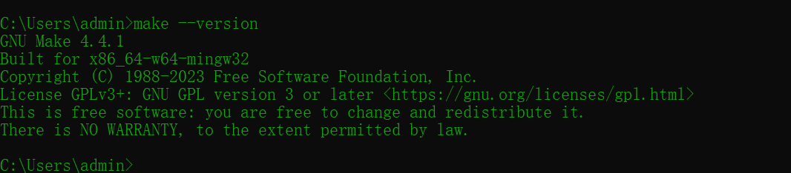

## Make 安装

一般来说，`make` 命令通常在 `linux` 下使用；

我们可以使用 `w64devkit` 这个套件来使用，该套件模拟了常用的一些 `linux` 供我们在 `windows` 终端上执行；用该套件也可以保持 `Makefile` 文件的书写和 `linux `是一致的；


 下载后，将 `w64devkit`  的 `bin` 目录配置到环境变量中即可使用 `make` 命令

成功配置后，在 `cmd` 中键入 `make --version`，出现版本号则表示配置成功




## Makefile基础知识
### make使用流程
- 准备编译好的源代码
- 编写 `Makefile` 文件
- 在命令行执行 `make` 命令

`Makefile` 的语法规则如下
```makefile
目标: 依赖
    待执行的命令
```

## 一个简单的 Makefile 文件
```makefile
# 目标为 main
# 依赖为 main.cpp
# 执行的命令为 g++ main.cpp -o main 
main: main.cpp
	g++ main.cpp -o main   #命令开头必须要使用一个 Tab，不能使用空格替代
```

也可以将目标、依赖、命令写为一行；但需要注意的是，写成一行的情况下，格式应该为 **目标: 依赖;  执行的命令**

例如：
```makefile
main: main.cpp; g++ main.cpp -o main
```

## 修改默认目标
**一般在执行 make 时，第一个目标即为默认目标**，如果你需要更改默认目标，可以使用 `.DEFAULT_GOAL` 来进行处理

```makefile
.DEFAULT_GOAL=main # 设置默认目标为 main，如果不指定的话，默认执行 make 就是执行了 all 这个目标
all: 
	echo "hello world"
main: main.cpp
	g++ main.cpp -o main
```

这样在执行 `make` 动作的时候，将不会执行 `all`，而是直接执行 `main`

## 伪目标

一般没有输出的目标，我们称之为伪目标。伪目标用 `.PHONY` 来声明；例如一般的 `Makefile` 文件中都会存在一个 `clean` 的目标，对中间过程中的产物做清理；

```makefile
.PHONY: clean
clean:
	-rm *.o *.exe
```

一般不使用`.PHONY` 也没有问题，但一旦你的文件目录下存在同名的 `clean` 文件，那么 `clean` 的目标将不会被执行；

### 忽略错误

在 `rm` 上加上 `-` 主要是为了防止多条 `rm` 命令执行时，某些文件不存在会导致 `rm` 执行失败，从而后续的所有 `rm` 都未被执行；

## 定义变量
`Makefile` 对变量的使用就是以字符串的形式来处理，所以如果引用了一个不存在的变量，那么该属性的值就为空串；

在 `Makefile` 文件中，定义变量的方式如下

```makefile
变量名=变量值
变量名?=变量值
变量名:=变量值
变量名::=变量值
变量名:::=变量值
变量名+=变量值
```

取变量值则直接采用 `$(变量名)` 或者 `${变量名}` 获取；如果变量名是一个单子符的话，可以省略括号；例如 `$a`，但一般不建议去掉括号

```makefile
obj = main.cpp

main: main.cpp
	g++ $(obj) -o main

```

这将在多个文件进行编译时非常有用